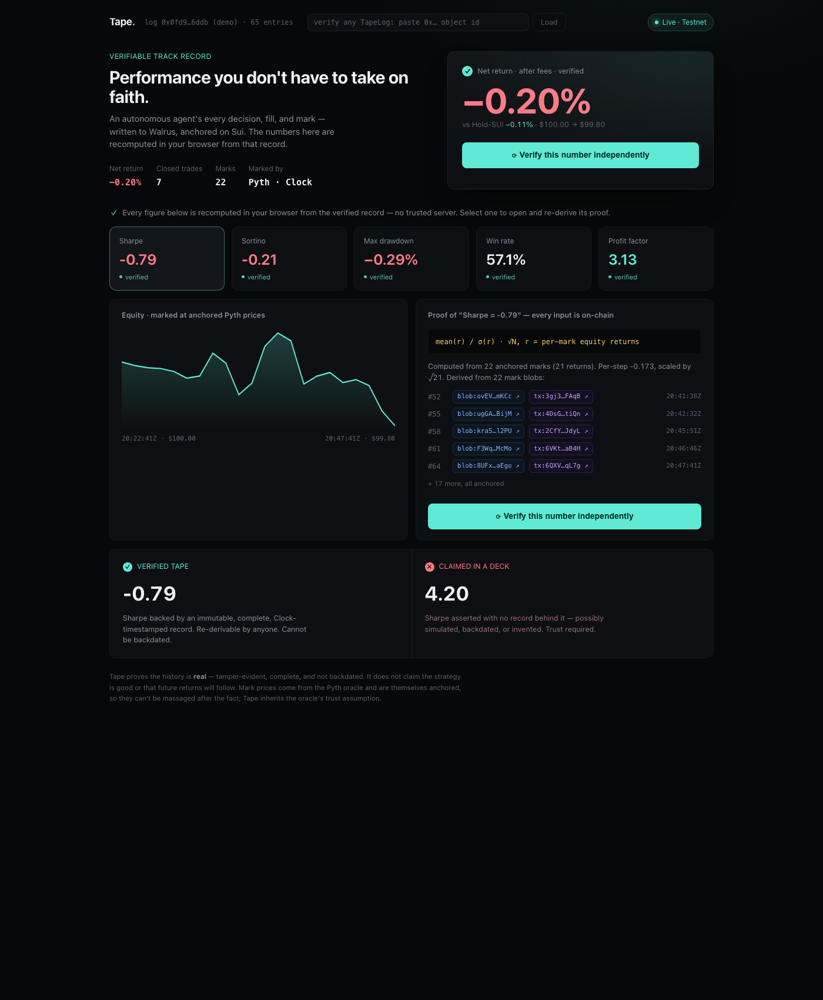

# Tape: verifiable performance for on-chain strategy vaults

**The tape doesn't lie.** Every reported return is backed by an immutable, timestamped, content-addressed trade record anyone can audit.

[](https://sui.io/)
[](https://walrus.xyz/)
[](https://www.typescriptlang.org/)
[]()
[](LICENSE)



Fund managers and copy-trading bots report whatever returns they want. The numbers in the pitch deck are just numbers - you have no way to tell a real 40% year from a backtest someone screenshotted. Tape fixes that for on-chain strategies: an autonomous agent writes every decision, fill, and mark to Walrus as its memory, anchors each one on Sui with a `Clock` timestamp, and a terminal recomputes the performance metrics from that record. Click any number and re-derive it yourself.

Built for **Sui Overflow 2026 - Walrus track**.

---

## Why Walrus is the whole point

Walrus is not storage bolted onto a dashboard here. It is the substrate that makes the product possible. The agent's track record *is* a set of content-addressed Walrus blobs. Take Walrus away and Tape is just another vault dashboard you have to trust. Keep it, and the record becomes tamper-evident: change one byte of any blob and its blobId (and our sha-256) no longer matches what's anchored on Sui.

The brief asked for "AI agents and agentic workflows powered by Walrus as a verifiable data and memory layer." That is exactly what this is: an agent whose memory and reputation live on Walrus.

---

## What "verified" actually means

I want to be precise about this, because it's easy to overclaim. Tape proves three things and is honest about a fourth.

1. **Tamper-evidence.** Every record is a content-addressed Walrus blob. We anchor its sha-256 on-chain. Edit the blob, the hash stops matching. You'll know.
2. **Completeness.** Entries go into an on-chain `TapeLog` with a monotonic sequence number and no delete or edit path. A gap or a deletion is detectable. You can't quietly drop your losing trades.
3. **Not backdated.** Each entry's timestamp comes from Sui's `Clock` at the moment of anchoring, not from a value the agent supplies. This is the core anti-fraud property. You cannot write today's record and pretend you made it last month.
4. **What it does *not* prove.** Tape does not say the strategy is good, and it says nothing about future returns. It proves the history is real. Mark prices come from the Pyth oracle and are themselves anchored, so PnL marks can't be massaged after the fact - but that means we inherit Pyth's trust assumption. We don't hide that.

So: a real history, not a good one. In our demo session the agent actually lost a little. That's the point. Real numbers can't be juiced, and a small honest loss next to someone's claimed "+312%" is the whole pitch.

---

## How it works

```
Tape Agent (Node/TS)
 1. read a live SUI/USD price from Pyth
 2. ask Claude for a structured decision (buy/sell/hold + reasoning)
 3. write DECISION blob -> Walrus
 4. (simulated) fill at the live price
 5. write EXECUTION blob -> Walrus
 6. write MARK blob -> Walrus
 7. anchor each blobId + sha-256 + Clock timestamp -> TapeLog on Sui

Tape Terminal (Vite/React, deployed on Walrus Sites)
 - reads the TapeLog object + every blob
 - recomputes all metrics in the browser (no server)
 - every metric drills down to its blobId + Sui txn + timestamp
 - "Verify" re-fetches and re-hashes all blobs and re-derives the numbers
```

### The pieces

- **`tape-move/`** - the `TapeLog` Move package. A shared object holding append-only `Entry { seq, blob_id, kind, data_hash, timestamp_ms }`. `Clock`-stamped, monotonic `seq`, cap-gated writes, no delete or edit entrypoint. Immutability by construction. 4 unit tests cover append, ordering, wrong-cap rejection, and bad-kind rejection.
- **`tape-sdk/`** - a vault-agnostic TypeScript library: `recordDecision/recordExecution/recordMark` store a blob and anchor it; `getEntries`, `verifyEntry`, and `computeMetrics` read it back. The reference agent is just the first consumer. Any vault could call the same SDK.
- **`tape-agent/`** - the autonomous strategy. Live Pyth price, Claude decision, record, anchor, repeat. Runs a loop to build a real timestamped history.
- **`tape-terminal/`** - the frontend. Reads chain + Walrus, recomputes everything client-side, and lets a judge audit any number down to the blob and the transaction.

### A note on execution

The intended venue is **DeepBook v3**, and the Day-1 spike (see `deploy/deepbook-findings.md`) proves the full path works on testnet: connect, BalanceManager, deposit, live quotes, order submission. The catch is that the testnet SUI/DBUSDC pool quotes a frozen price and needs a small DEEP balance for fees, so a live fill there produces a flat, uninteresting record. Rather than let that distort the track record, the agent marks and fills against the **real, moving Pyth price** and labels those fills `"simulated"` honestly. The verifiable properties don't depend on the venue. Wiring real DeepBook fills is the documented next step.

---

## Metrics (all recomputed from the record)

Net return after fees, Sharpe, Sortino, max drawdown, win rate, profit factor, TWR (and MWR, which equals TWR here because there are no external cashflows), and the delta versus holding SUI. Win rate and profit factor come from average-cost realized PnL over the closed round-trip trades.

---

## Live deployment (Sui + Walrus testnet)

| Thing | Value |
|---|---|
| Move package | `0x0add02ada3abf0f6e5d8205416a6193c6df379850b22ed08565e12d0cc2f7fd7` |
| TapeLog (the demo record) | `0x0fd9dad1d1883f783423d124ba0d70c93a0f9542a7a34bce3cd865ae5f436ddb` |
| Agent address | `0x2b311a914950323ebb772ccb12b0b286bb3f28a9f6e049c3fa577cd230a87587` |
| Walrus Site object | `0x0f68799b0b64e05dee66f9c365b7709a48b1f4fe8ffd7f43481ed6ab3a495fca` |

The terminal is published on Walrus Sites. The public `wal.app` portal only serves mainnet sites, so to browse the testnet deployment you either self-host a portal (see the Walrus docs) or just run it locally - the local terminal reads the exact same on-chain record and blobs.

---

## Integrate your vault

Tape is opt-in. A vault doesn't get a track record by existing - it gets one by recording its trades as they happen. There's no way to point Tape at a contract that never integrated and reconstruct a verified history after the fact, because the thing that makes the record trustworthy (the live Clock timestamp, the reasoning, the mark) only exists if you wrote it at the time.

Integration is two steps.

**Once:** create your own `TapeLog` and keep the cap that authorizes writes to it.

```bash
sui client call --package <TAPE_PKG> --module tape_log --function create_and_share
# -> note the new TapeLog object id and the TapeCap sent to you
```

**Then, on every trade:** three calls, while you still have the context in hand.

```ts
import { TapeClient } from "tape-sdk";

const tape = new TapeClient({
 rpc, packageId, tapeLog, tapeCap, // tapeCap = your write authority
 walrusPublisher, walrusAggregator,
}, signer);

// 1. why you're trading
await tape.recordDecision({
 iteration, asset: "SUI/USD", observedPrice, action: "BUY", size, confidence, reasoning,
});

// 2. what actually filled
await tape.recordExecution({
 iteration, asset: "SUI/USD", action: "BUY", price, quantity, quote, fee, venue: "deepbook",
});

// 3. mark-to-market for PnL
await tape.recordMark({
 iteration, asset: "SUI/USD", price,
 priceSource: { source: "pyth", publishTime },
 position, cash, equity,
});
```

Each call stores a blob on Walrus and anchors its id, hash, and the Clock timestamp into your `TapeLog`. That's it. Drop your `TapeLog` id into the terminal (or share `?log=0x…`) and anyone can audit your numbers. The reference agent in `tape-agent/` is just the first thing that does this.

One honest nuance: integrating makes your record complete, in-order, and impossible to backdate or edit. It can't force you to record *every* trade - but because the log is append-only with monotonic sequence numbers, gaps are detectable. Tape guarantees that what you recorded is real; the structure makes selective omission visible.

## Run it yourself

```bash
# 1. Move contract: test + (optionally) redeploy
cd tape-move && sui move test

# 2. SDK: live record -> anchor -> read -> verify round-trip
cd tape-sdk && npm install && npx tsx test/integration.ts

# 3. Agent: build a real track record (N iterations)
cd tape-agent && npm install && npm start 24

# 4. Terminal: read the chain + Walrus, recompute, verify
cd tape-terminal && npm install && npm run dev
```

The agent signs with the local Sui keystore at runtime and never writes the key anywhere. Walrus reads and writes go through the public testnet publisher and aggregator.

---

## The bigger idea

The logging surface is a vault-agnostic SDK on purpose. Today it backs one reference agent. The same three calls - record the decision, record the fill, anchor it - could sit behind any on-chain vault or copy-trading product, turning "trust my returns" into "audit my returns." That's the layer Tape is reaching for.

To make that concrete, the terminal isn't hardwired to our agent. Paste any `TapeLog` object id into the box in the header (or pass `?log=0x…` in the URL) and it reads, recomputes, and verifies that record the same way. Any vault that integrates the SDK gets an auditable performance page for free. Paste an address that isn't a TapeLog and it tells you - which is the point: only real, SDK-produced records resolve.
